<!-- Please do not change this html logo with link -->
<a target="_blank" href="https://www.microchip.com/" id="top-of-page">
   <picture>
      <source media="(prefers-color-scheme: light)" srcset="images/logos/mchp_logo_light.png" width="350">
      <source media="(prefers-color-scheme: dark)" srcset="images/logos/mchp_logo_dark.png" width="350">
      
   </picture>
</a>

# TCP/IP Lite Solutions Using ENCX24J600 on PIC16F18857

This repository provides MPLAB® X IDE projects that will work out of the box with the hardware and software listed below. The solutions in the repository include functionalities for the [User Datagram Protocol (UDP)](#udp-solution), [Transmission Control Protocol (TCP) Server](#tcp-server-solution) and [TCP Client](#tcp-client-solution) Demos. Note that the TCP/IP Lite stack needs to be serviced every one second and the timer callback function needs to be set to one second. Change the pin allocations for the Serial Peripheral Interface (SPI), Switch and LED if a different device is used.

---

## Related Documentation  

<picture></picture>

## Software Used

- [MPLAB X IDE v6.10 or later](http://www.microchip.com/mplab/mplab-x-ide)
- [MPLAB XC8 v2.41 or later](https://www.microchip.com/en-us/tools-resources/develop/mplab-xc-compilers/downloads-documentation#XC8)
- [MPLAB Code Configurator v5.3.7 or later](https://www.microchip.com/en-us/tools-resources/configure/mplab-code-configurator)
- [TCP/IP Lite Stack v5.0.0](https://www.npmjs.com/package/@mchp-mcc/tcpip-lite/v/5.0.0)
- [Ethernet Drivers Library v6.0.0](https://www.npmjs.com/package/@mchp-mcc/ethernet-drivers-8bit/v/6.0.0)
- [TCPIP Demo GUI v1.0](TCPIP_Demo.jar)
- [Wireshark Tool](https://www.wireshark.org/)

## Hardware Used

- [Curiosity High Pin Count (HPC) Development Board](https://www.microchip.com/en-us/development-tool/dm164136)
- [PIC16F18857 in SPDIP Packaging](https://www.microchip.com/en-us/product/PIC16F18857)
- [Serial Ethernet 2 Board](https://www.mikroe.com/serial-ethernet-2-board)

## More details can be found at the following links

- [Microchip Ethernet Controllers](https://www.microchip.com/design-centers/ethernet/ethernet-devices/products/ethernet-controllers)
- [Microchip Evaluation Boards](https://www.microchip.com/en-us/tools-resources/evaluation-boards)

## Hardware Setup

1. Place the PIC16F18857 in the 28-pin socket on Curiosity HPC Development board.
2. Connect the Serial Ethernet 2 Board to the mikroBUS™ 1 port on the Curiosity HPC Development board and set the DIP switches according to the following connection diagram:
 <picture>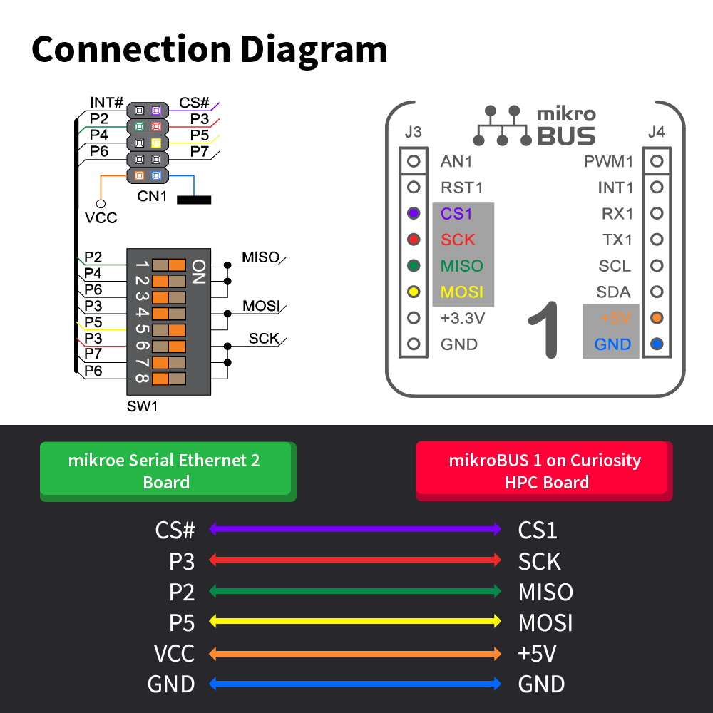</picture> 

3. The pins were set in MPLAB Code Configurator based on the available pins on the PIC16F18857 and Curiosity HPC board. 
 <picture>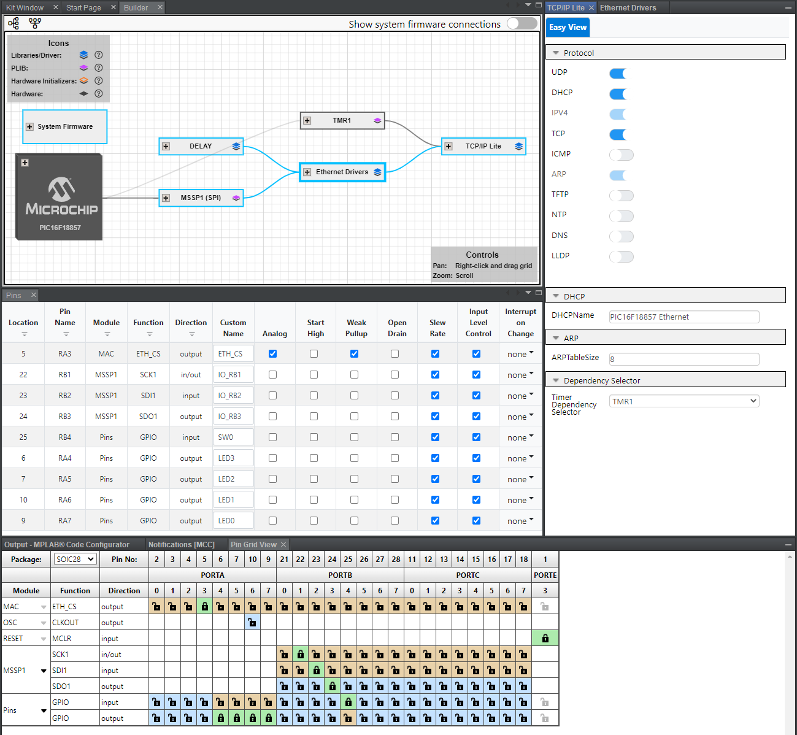</picture> 

---

## UDP Solution
<a target="_blank" href="https://www.microchip.com/en-us/tools-resources/develop/mplab-x-ide/">
   <picture>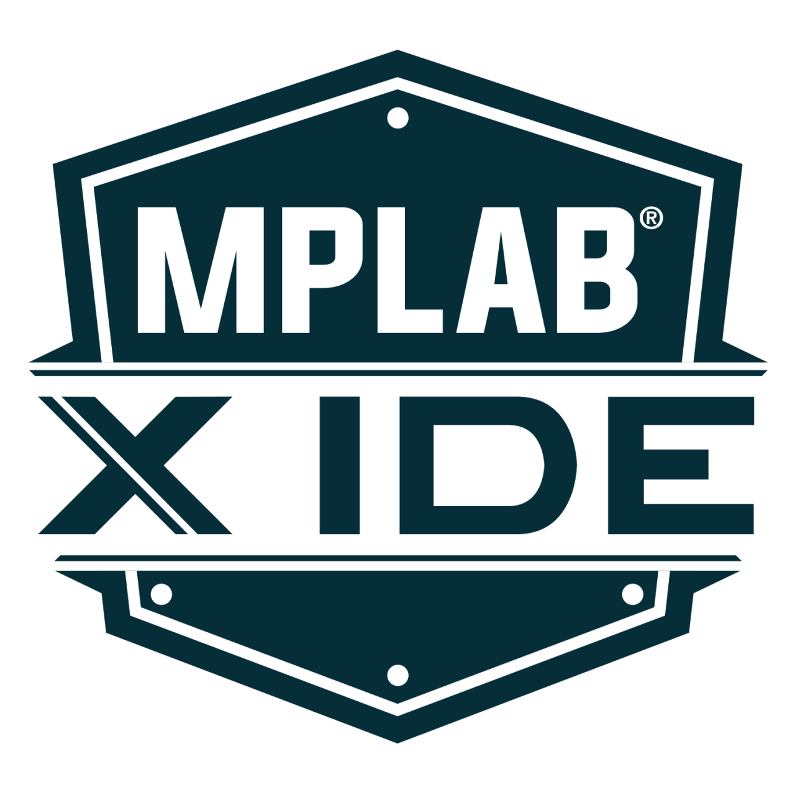</picture>
</a>

1. Open the MPLAB X IDE. Connect the Curiosity HPC Development board with PIC16F18857 installed in the 28-pin socket.
    

2. From the downloaded projects, open `encx24j600-udp-solution.X`.
    Right click the project name and select Set as Main Project.
    <picture>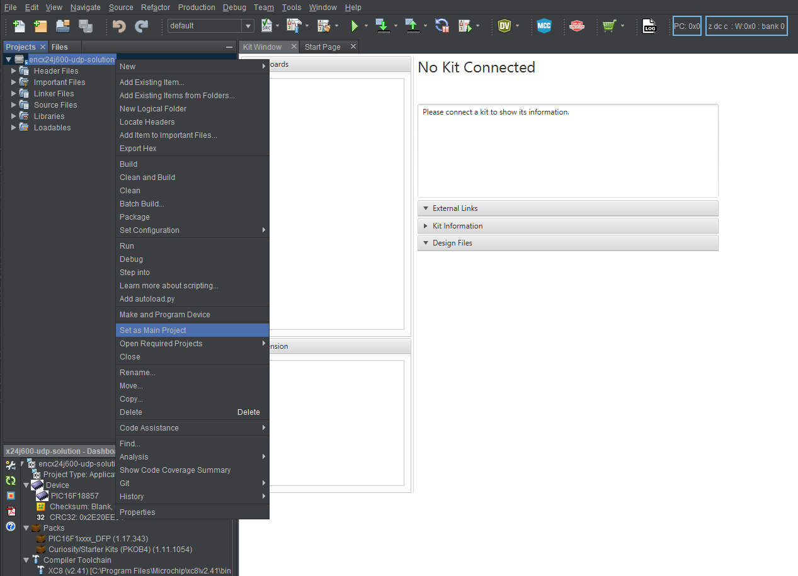</picture>  
    

3. Open the Windows Command Prompt application on your PC. Type `ipconfig` to get the IP address of your PC.
    <picture>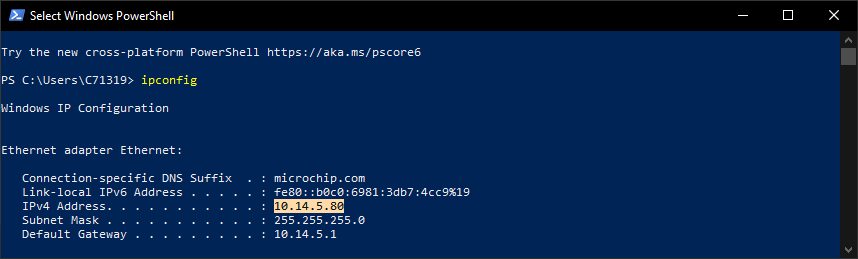</picture>  
    

4. Go to `Source Files\App Files\src` and open `udp_demo.c`. Under the function `UDP_Demo_Initialize()`:  
   - Modify the destination IP address with PC IP address as noted in Step 3
   - Modify the destination port (anything in the range of dynamic ports)
    <picture>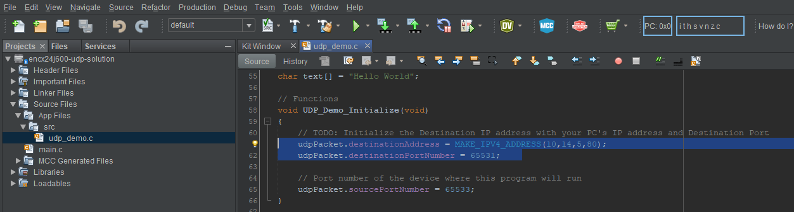</picture>  
    

5. Go to `Source Files\MCC Generated Files\tcpiplite\src\` and open `udpv4_port_handler_table.c`.
   - In `UDP_CallBackTable[]`, add the following code to perform UDP Receive: `{65531, UDP_Demo_Recv}`.
    65531 is the port chosen in Step 4.
    <picture>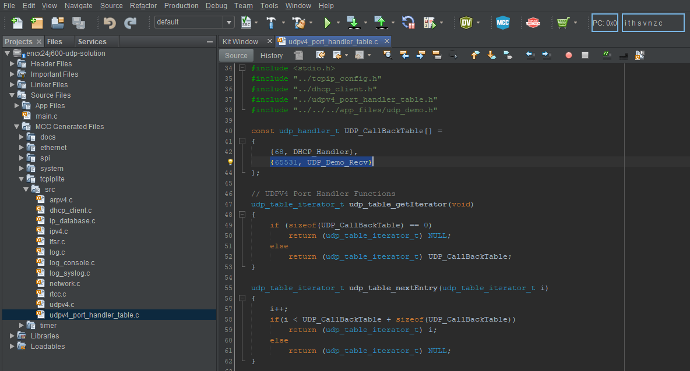</picture>  
    

6. Launch Wireshark. From the Capture menu, click Options.
    Select an interface from the list to which your HPC Development board and PC are connected, click **Start** for capturing packets.
    Or select the respective interface on the start screen of Wireshark.
    E.g., Ethernet from the attached screenshot at Step 3 above.
    <picture>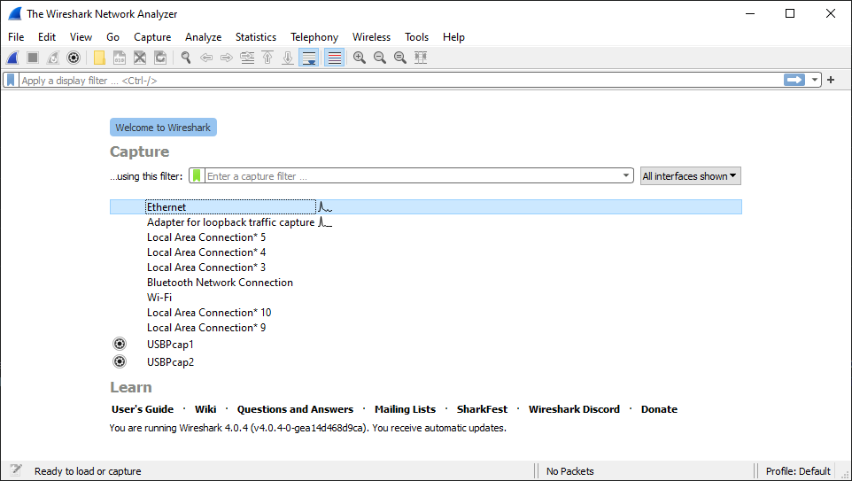</picture>  
    

7. In Wireshark, set the filter field as `dhcp||icmp` and hit 'Enter' or click the arrow on the right end.
    <picture>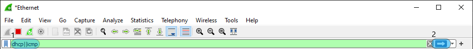</picture>  
    

8. Go back to MPLAB X IDE and click **Make and Program Device** to program the code to the device.
    <picture>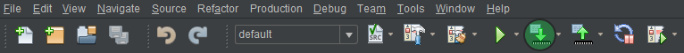</picture>  
    

9. In Wireshark, check the DHCP packets to verify that the device is connected to the selected network. The handshake procedure will look as shown below:
    <picture>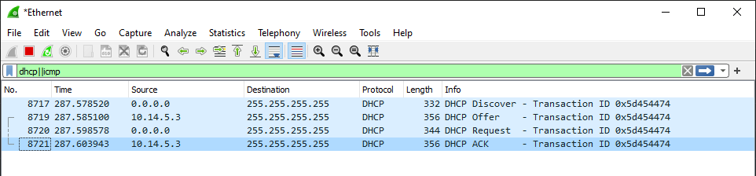</picture>  
    

10. In Wireshark, click the “ACK” packet (or double click to open in new window). Expand “Dynamic Host Configuration Protocol” to get the device IP address.
    <picture>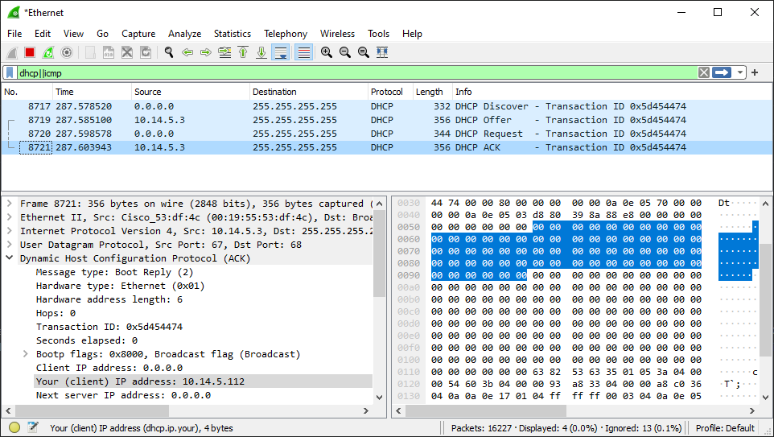</picture>  
    

11. Open the Java application `TCPIP_Demo.exe`. Go to the **UDP** tab and assign the same port number as `udpPacket.destinationPortNumber` in `UDP_DEMO_Send()`.
    E.g., 65531 was chosen in Step 4.
    Click the **Listen** button. Click “Allow Access” if warning occurs. Assign the IP address of your HPC Development board which was found from Step 10.
    E.g., 10.14.5.112 from the attached screenshot in Step 10 above.
    Click the **Claim** button.
    <picture>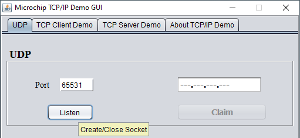</picture><picture>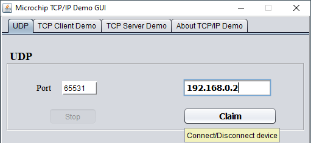</picture>  
    

12. In Wireshark, set the filter in the format `dhcp||udp.port==65531` but with your chosen port number, 65531 in this example.
    <picture>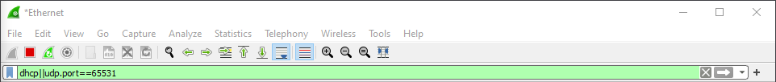</picture>  
    

13. In Demo GUI, under UDP Send/Receive click the LED 1 to turn ON LED0 on the Curiosity HPC Development board and observe the Wireshark capture.
    <picture>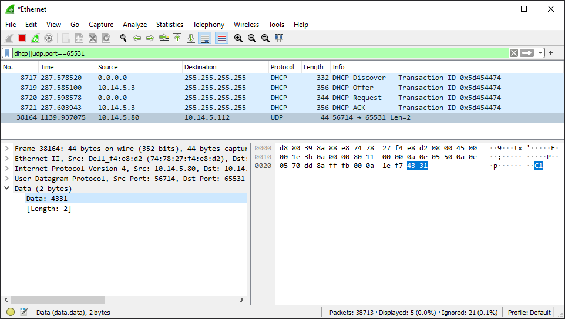  
    

14. In Demo GUI, inside the Send Data box type something (e.g., "Hello CNano").
    <picture>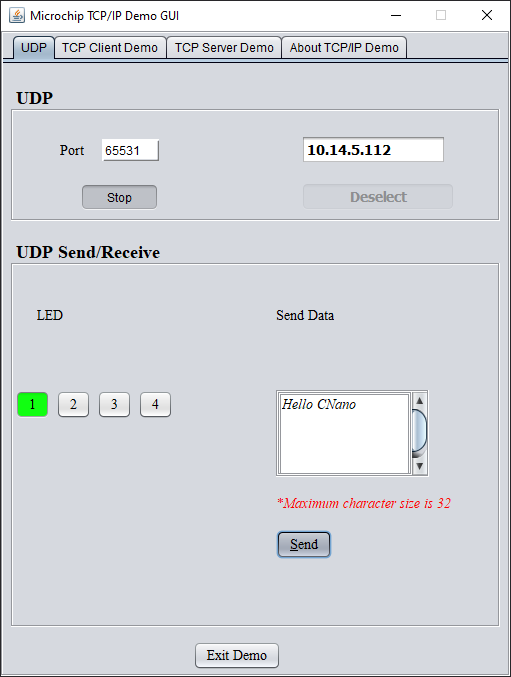</picture>
    Click the **Send** button. Check the packet in the Wireshark capture.
    <picture>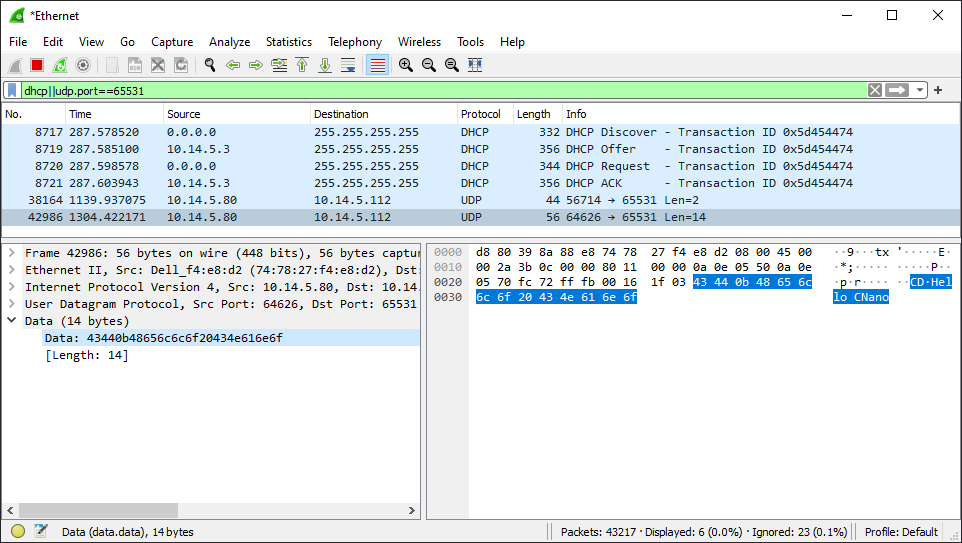</picture>  
    

15. Press the Switch SW0 on the Curiosity HPC Development board. Check the packet in the Wireshark capture.
    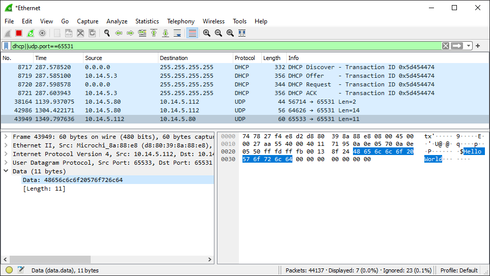  
    

[:top: Back to Top](#top-of-page)

---

## TCP Client Solution
<a target="_blank" href="https://www.microchip.com/en-us/tools-resources/develop/mplab-x-ide/">
   <picture></picture>
</a>

1. Open MPLAB X IDE. Connect the Curiosity HPC Development board with PIC16F18857 installed in the 28-pin socket.  
    

2. From the downloaded projects, open `encx24j600-tcp-client-solution.X`.
    Right click the project name and select Set as Main Project.
    <picture>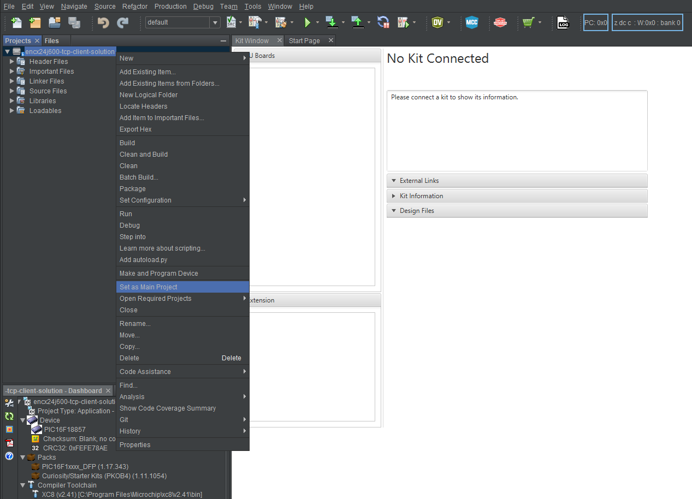</picture>  
    

3. Open the Windows Command Prompt application on your PC. Type `ipconfig` to get the IP address of the PC.
    <picture></picture>  
    

4. Go to `Source Files\App Files\src` and open `tcp_client_demo.c` from the project files. Under the function `TCP_Client_Initialize()`:
   - Modify the remote IP address with PC’s IP address as noted in Step 3
   - Modify remote port (anything in the range of dynamic ports)
    <picture>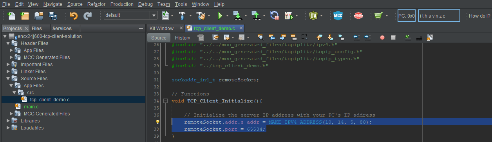</picture>  
    

5. Click the **Make and Program Device** to program the code to the device.
    <picture></picture>  
    

6. Open the Java application `TCPIP_Demo.exe`. Go to the **TCP Server Demo** tab and assign the same port as `remoteSocket.port` in `TCP_Client_Initialize()`.
    E.g., 65534 chosen in Step 4.
    Click the **Listen** button.
    The status of the TCP connection is printed inside the STATUS text box.
    <picture>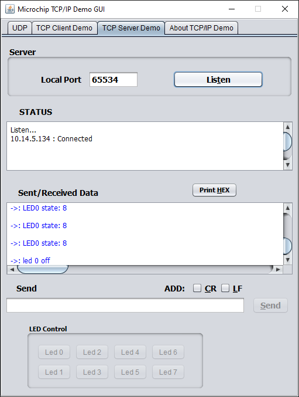</picture>  
    

7. Launch Wireshark. From the Capture menu, click Options.
    Select an interface from the list to which your HPC development board and PC are connected, click **Start** for capturing packets.
    Or select the respective interface on the start screen of Wireshark.
    E.g., Ethernet from the attached screenshot at Step 3 above.
    <picture></picture>  
    

8. In Wireshark, set the filter in the format `dhcp||tcp.port==65534` but with the chosen port number instead of `65534`.
    <picture>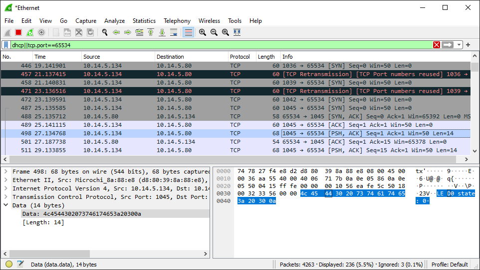</picture>  
    

9. After the connection is established, type some text inside the Send text box and click the **Send** button.
    The text sent is displayed inside the Sent/Received Data text box.
    <picture>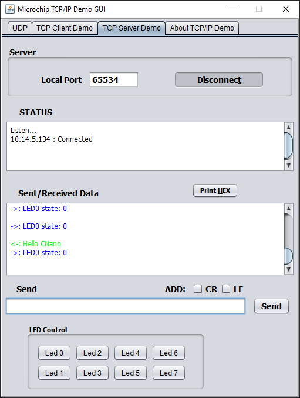</picture>  
    

10. In Wireshark, keeping the same filter settings as in Step 8, check the TCP packets being sent from the PC to the HPC Development board.
    <picture>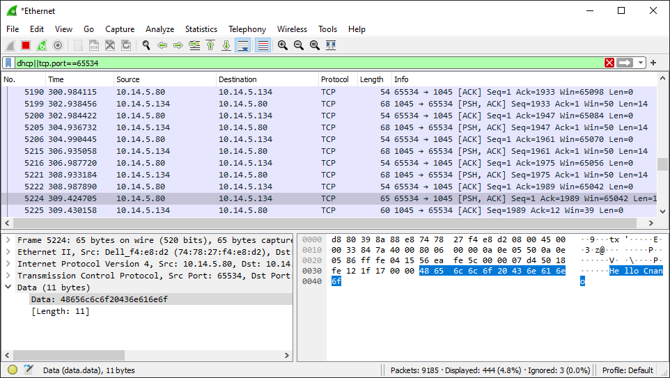</picture>  
    

11. Click the **Led 0** button inside the `LED Control` Field. This will turn on LED0 on the HPC Development board.
    <picture>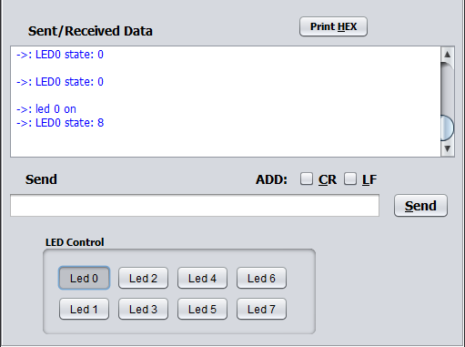</picture>  
    

12. In Wireshark, keeping the same filter settings as in Step 8, check the TCP packets being sent from the HPC Development board to the PC.
    <picture>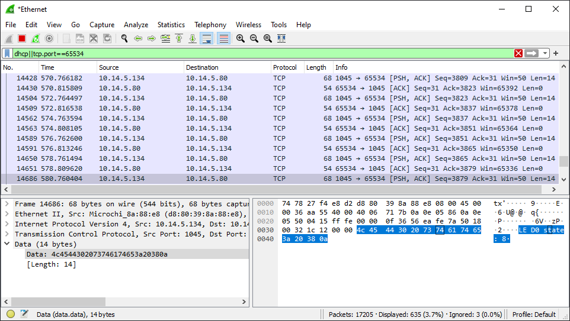</picture>  
    

13. Click the **Disconnect** button from the Demo GUI to close the TCP connection. Inside the STATUS text box a message will appear stating "Client Disconnected".
    <picture>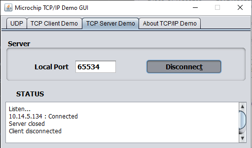</picture>  
    

[:top: Back to Top](#top-of-page)

---

## TCP Server Solution
<a target="_blank" href="https://www.microchip.com/en-us/tools-resources/develop/mplab-x-ide/">
   <picture></picture>
</a>

1. Open MPLAB X IDE. Connect the Curiosity HPC Development board with PIC16F18857 installed in the 28-pin socket.  
    

2. From the downloaded projects, open `encx24j600-tcp-server-solution.X`.
    Right click the project name and select Set as Main Project.
    <picture>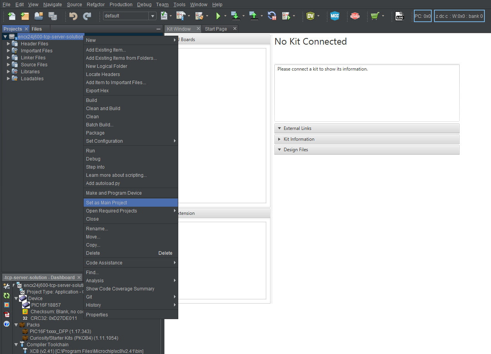</picture>  
    

3. Launch Wireshark. From the Capture menu, click Options.
    Select an interface from the list to which the HPC Development board and PC are connected, click **Start** for capturing packets.
    Or select the respective interface on the start screen of Wireshark.
    <picture></picture>  
    

4. In Wireshark, set the filter field as `dhcp||icmp` and hit 'Enter' or click the arrow on the right end.
    <picture></picture>  
    

5. Go back to MPLAB X IDE and click **Make and Program Device** to program the code to the device.
    <picture></picture>  
    

6. In Wireshark, check the DHCP packets to verify that the device is connected to the selected network. The handshake procedure will look as shown below:
    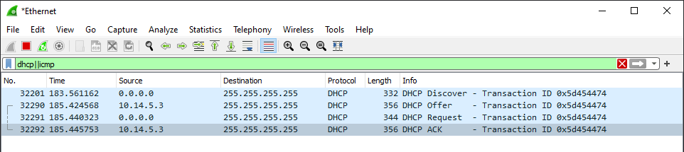  
    

7. In Wireshark, click the “ACK” packet (or double click to open a new window). Expand the “Dynamic Host Configuration Protocol” to get the device IP address.
    <picture>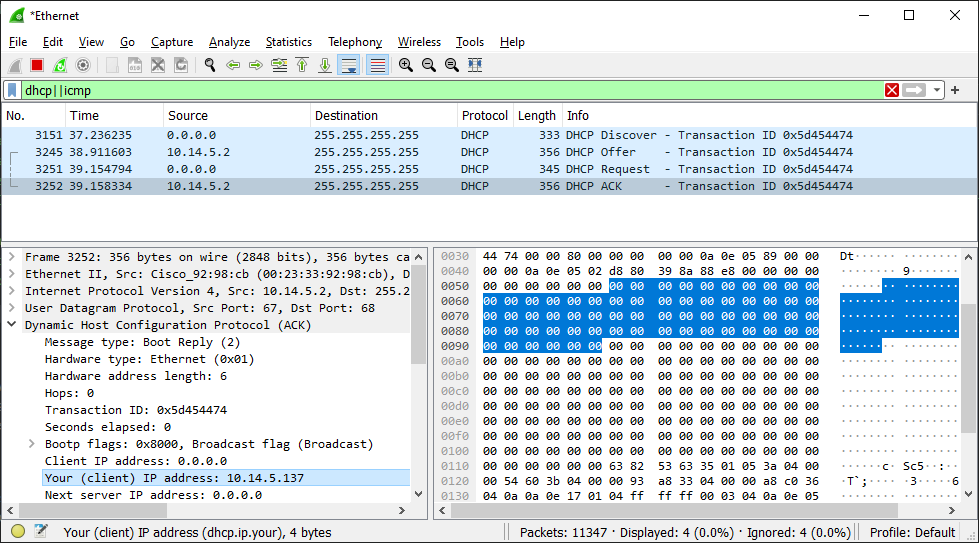</picture>  
    

8. Open the Java application `TCPIP_Demo.exe`. Go to the **TCP Client Demo** tab.
    Assign the server IP address as the IP address noted from Wireshark in Step 7.
    Assign the port number as 7.
    Click the **Connect** button. The status of the TCP connection is printed inside the STATUS text box.
    <picture>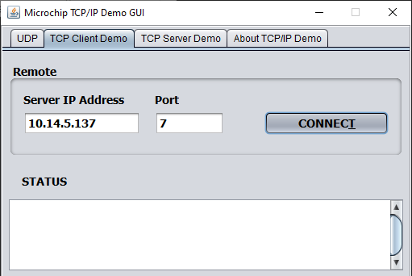</picture><picture>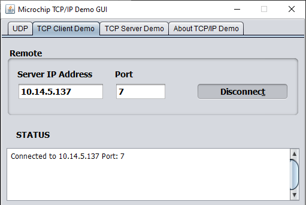</picture>  
    

9. After the connection is established, type some text inside the Send text box and click the **Send** button.
    The text sent is echoed and displayed inside the Sent/Received Data text box.
    <picture>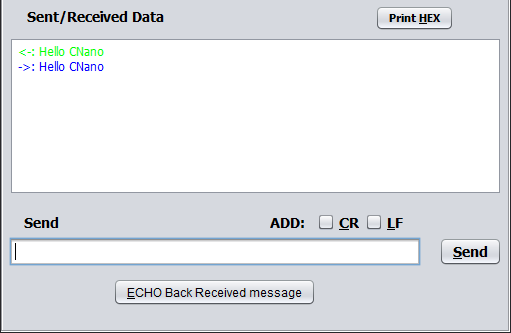</picture>  
    

10. In Wireshark, set the filter as `dhcp||tcp.port==7`
    Check the TCP packets being sent from the HPC Development board to the PC.
    <picture>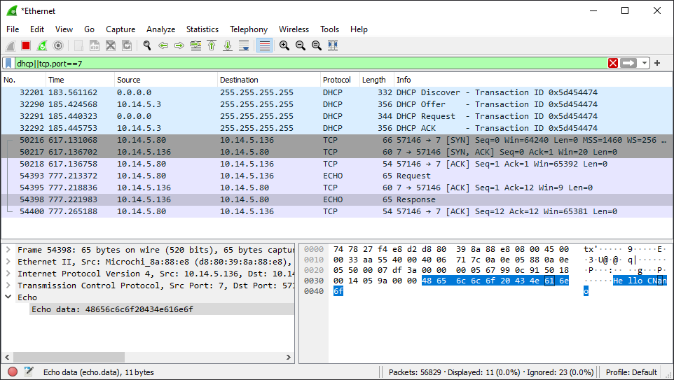</picture>  
    

11. Push the **Disconnect** button in the Demo GUI to close the TCP connection. Inside the STATUS text box a message will appear stating "Connection Closed".
     <picture>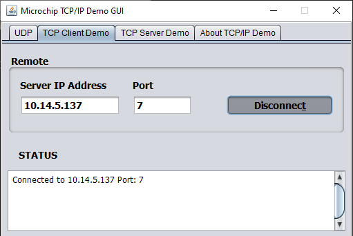</picture><picture>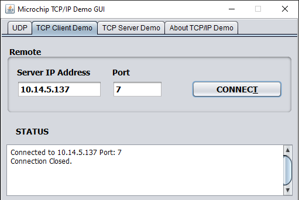</picture>  
     

[:top: Back to Top](#top-of-page)

---

   
   

